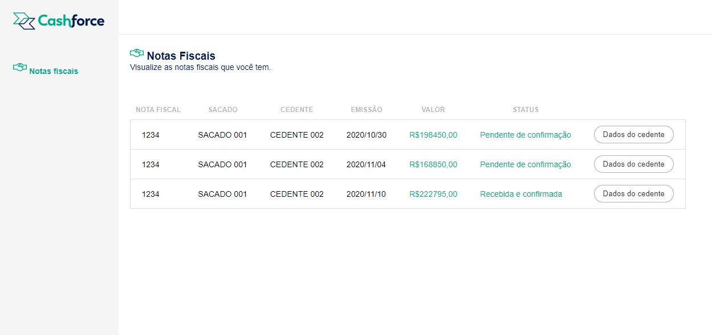

# Challenge - Cashforce
Desafio realizado para o desafio técnico da empresa Cashforce.

## O Teste

O teste consistiu em criar uma API em Node utilizando preferencialmente express e sequelize, conectada a um banco de dados que foi disponibilizado.

Após a criação dessa API, tive que construir uma tela, previamente especificada no Figma, preferencialmente em vue.js, consultando a API criada por mim e exibindo os dados que estão retornando dessa API.

## Dificuldades encontradas

Na criação da API, a maior dificuldade foi realizar todo o setup do sequelize utilizando Typescript.

Já o front foi um desafio como um todo, uma vez que nunca tive contato com o Vue.js.

## Stacks utilizadas

 - **Front:**  Vue.js, Vitest, Heroku;

 - **Back:** Node, Express, Sequelize, Typescript, Jest, Mocha, Chai, Sinon, Heroku, Supabase, Docker.

## Deploy

O deploy do resultado final encontra-se nos links:
 - [Frontend](https://alexandre-cashforce.herokuapp.com/)
 - [Endpoint do backend](https://alexandre-pimentel-cashforce.herokuapp.com/order)




## Rodando localmente

Clone o projeto

```bash
  git clone https://link-para-o-projeto
```

Entre no diretório do projeto

```bash
  cd challenge-cashforce
```

### Para rodar o backend

Entre no diretório do backend

```bash
  cd app/back-end
```

Instale as dependências

```bash
  npm install
```

Altere o arquivo `.env.example` com os seus dados e renomeie-o para `.env`

```.yml
# Exemplo
PORT=3005
DB_USER=root
DB_PASS=123456
DB_NAME=challenge_cashforce
DB_PORT=3306
```

Inicie o servidor

```bash
  npm run dev
```

### Para rodar o frontend

Entre no diretório do frontend

```bash
  cd app/front-end/challenge-cashforce
```

Instale as dependências

```bash
  npm install
```

Inicie o servidor

```bash
  npm run dev
```
